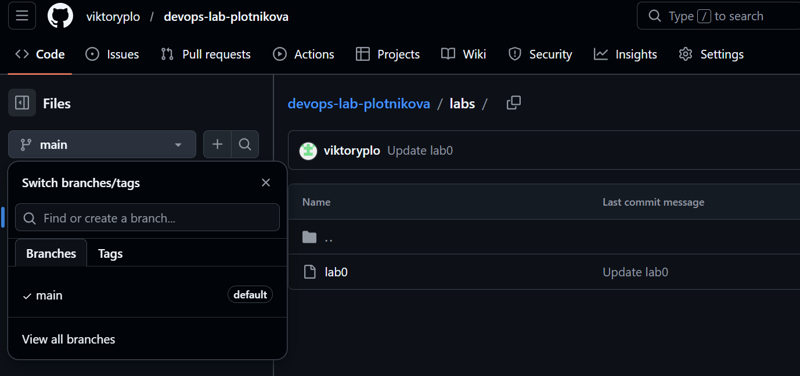

Lab: Lab0 
  Date of create: 02.03.2026 
  Date of finished: 02.03.2026 

Отчет:
1) Аккаунта на GitHub у меня не было, по инструкции создала, сгенерировала SSH ключ для работы с репозиториями
2) Создала свой первый репозиторий: https://github.com/viktoryplo/devops-lab-plotnikova
3) Через консоль компьютера скопировала репозиторий с помощью команды git clone
4) Создала файлы README.md, .gitignore 
5) Создала новую ветку develop, в ней добавила новый файл CONTRIBUTING.md
6) Сделала commit в ветке  develop
7) Смержила pull request, удалила ветку develop

