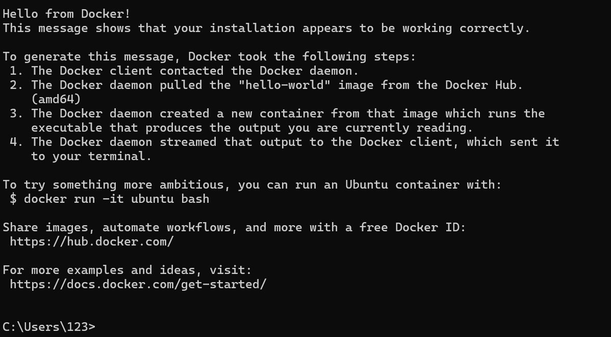
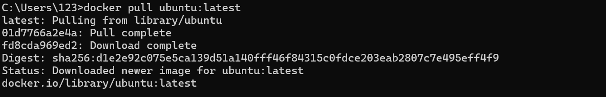
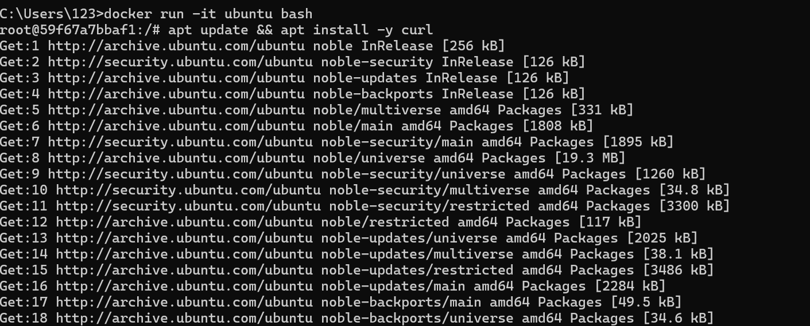
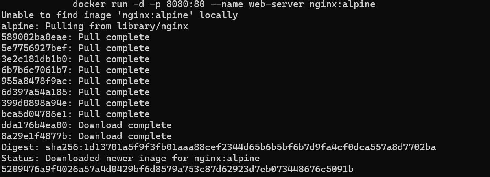
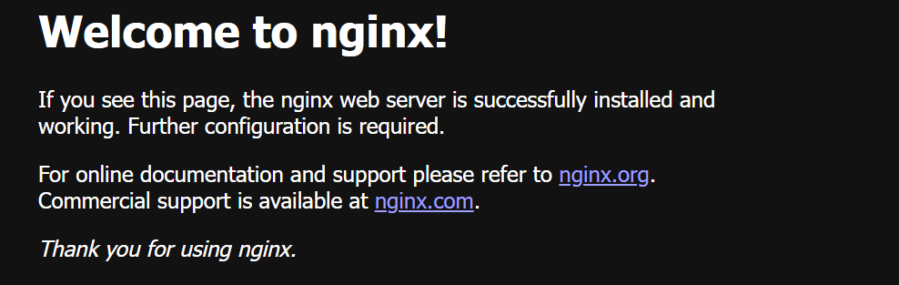
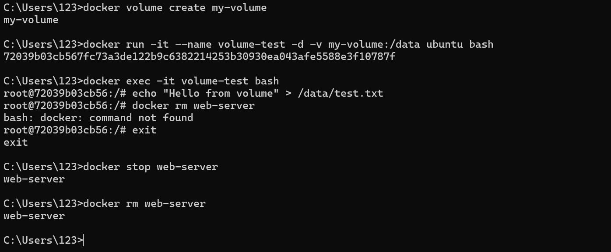
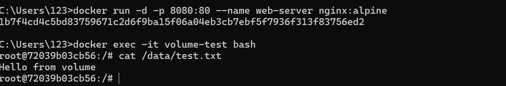

University: [ITMO University](https://itmo.ru/ru/)  
Faculty: [FICT](https://fict.itmo.ru)  
Course: [Введение в веб технологии](https://itmo-ict-faculty.github.io/introduction-in-web-tech/)  
Year: 2025/2026  
Group: U4125  
Author: Плотникова Виктория Артемовна  
Lab: Lab0  
Date of create: 01.03.2026  
Date of finished:  

Отчет:
1) Скачала Docker на Windows
   - обновила весию Linux на компьютере  
   - проверила установку  
   - поработала с базовыми командами:  
  
2) Скачала образ Ububtu
   - запустила интерактивный контейнер и пакет curl:

4) Запустила контейнер nginx
   - проверила работу в браузере, тут все работает корректно:

5) Посмотрела запущенные контейнеры, все контейнеры, остановила контейнер, запустила установленный, остановила и удалила образ:
 Далее по инструкции  
   - создала том
   - запустила контейнер с томом
   - подключила и создала файл через: echo "Hello from volume" > /data/test.txt:
  
7) Удалила контейнер и создала новый с тем же томом + проверила, что файл сохранился:

В результате работы я научилась на базовом уровне работать с Docker: устанавливать, создавать Dockerfile, собирать образы, запускать контейнеры и управлять ими.
