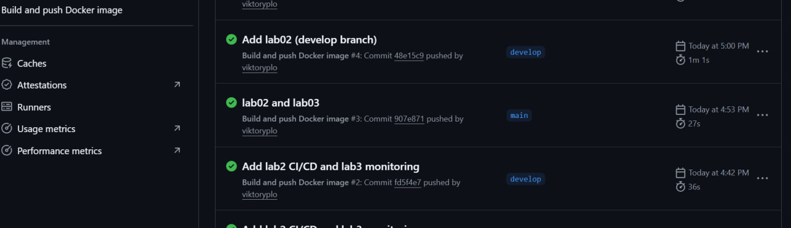

University: [ITMO University](https://itmo.ru/ru/)  
Faculty: [FICT](https://fict.itmo.ru)  
Course: [Введение в веб технологии](https://itmo-ict-faculty.github.io/introduction-in-web-tech/)  
Year: 2025/2026  
Group: U4125  
Author: Плотникова Виктория Артемовна  
Lab: Lab2  
Date of create: 10.03.2026  
Date of finished:  

Отчет:
1) Подготовила приложение из первой лабораторной работы:  
   - создала папку `lab2` в репозитории  
   - добавила файл `app.py` с простым Flask-приложением  
   - добавила файл `requirements.txt` с зависимостями  
   - добавила `Dockerfile` для сборки Docker-образа
       
     
2) Собрала локально Docker-образ и проверила его работу:  
   - `docker build -t my-flask-app:lab2 ./lab2`  
   - `docker run --rm -p 5000:5000 my-flask-app:lab2`  
   - открыла в браузере `http://localhost:5000` и убедилась, что приложение отвечает  

3) Настроила CI/CD пайплайн на GitHub Actions для автоматической сборки и публикации образа:  
   - добавила workflow `.github/workflows/docker-build.yml`  
   - настроила запуск по push в ветки `main` и `develop`  
   - использовала Docker Buildx для сборки  
   - настроила логин в Docker Hub через секреты репозитория  
   - настроила шаг сборки и пуша образа `DOCKER_USERNAME/my-flask-app:latest` из контекста `./lab2`  
   - добавила два шага «деплоя» в виде `echo`:  
     - для ветки `develop` сообщение `Deploying to development server...`  
     - для ветки `main` сообщение `Deploying to production server...`  
     
 
4) Настроила секреты GitHub репозитория для работы с Docker Hub:  
   - в разделе Settings → Secrets and variables → Actions создала секрет `DOCKER_USERNAME`  
   - в том же разделе создала секрет `DOCKER_PASSWORD` (пароль или токен Docker Hub)  
   - убедилась, что секреты используются в workflow  
   - скриншот страницы с секретами:  

5) Создала ветку `develop` и протестировала пайплайн для обеих веток:  
   - локально создала ветку разработки: `git checkout -b develop`  
   - сделала commit и push в ветку `develop` и убедилась, что в логах Actions выводится сообщение о деплое на dev (`Deploying to development server...`)  
   - затем переключилась на ветку `main`, сделала изменения, commit и push  
   - в разделе Actions проверила, что workflow запустился автоматически для `main`  
   - просмотрела логи всех шагов, убедилась в успешном логине в Docker Hub, сборке и пуше образа, а также в сообщении о деплое на production (`Deploying to production server...`)  
   - открыла Docker Hub и проверила появление образа `my-flask-app:latest`  
      

Результат работы:  
В результате выполнения лабораторной работы №2 настроила простой CI/CD пайплайн на GitHub Actions для автоматической сборки и публикации Docker-образа Flask-приложения в Docker Hub с использованием секретов и шагом условного деплоя (в виде заглушки).  

