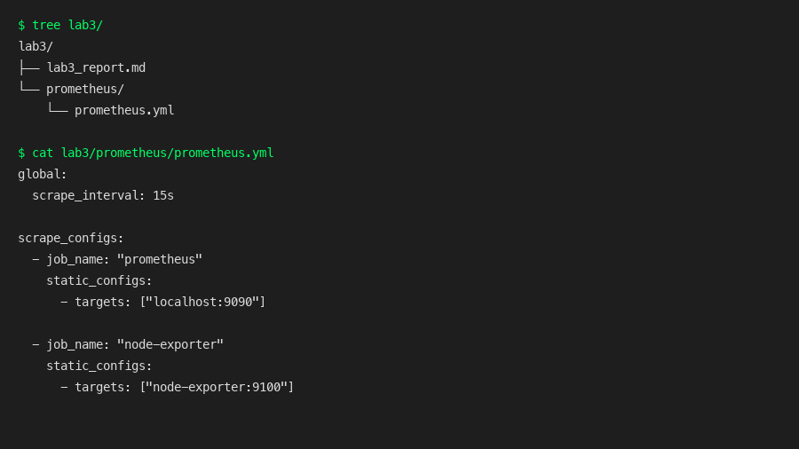
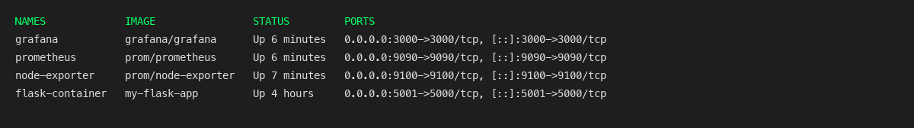
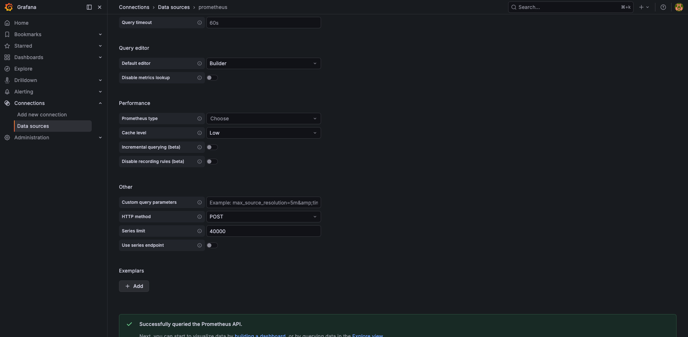
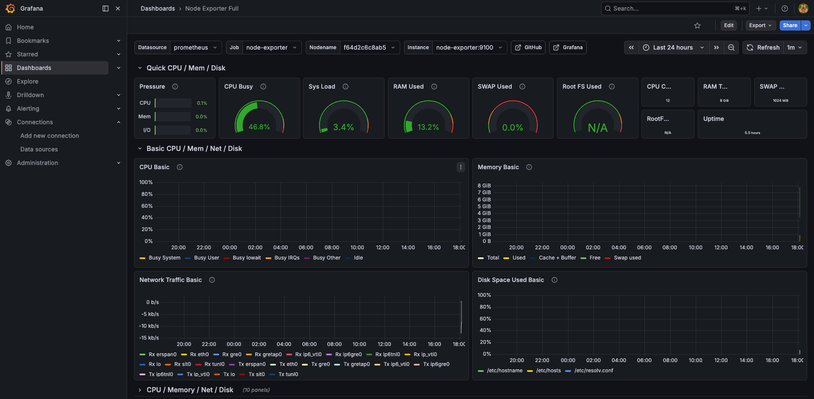
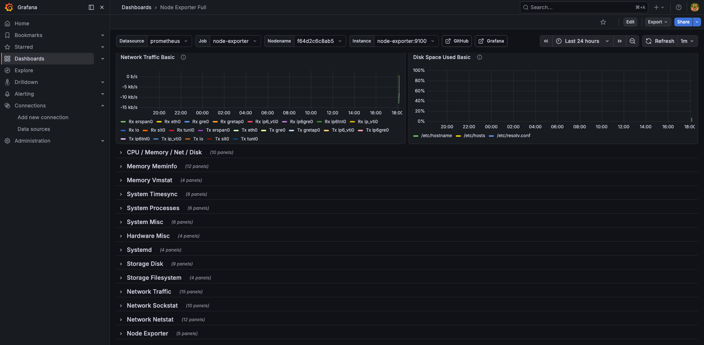

University: [ITMO University](https://itmo.ru/ru/)  
Faculty: [FICT](https://fict.itmo.ru)  
Course: [Введение в веб технологии](https://itmo-ict-faculty.github.io/introduction-in-web-tech/)  
Year: 2025/2026  
Group: U4125  
Author: Плотникова Виктория Артемовна  
Lab: Lab3  
Date of create: 10.03.2026  
Date of finished:  

Отчет:
1) Подготовила конфигурацию Prometheus:  
   - создала папку `lab3/prometheus` в репозитории  
   - добавила файл `prometheus.yml` со стандартной конфигурацией:  
     - глобальный интервал сбора метрик `scrape_interval: 15s`  
     - job `prometheus` с таргетом `localhost:9090`  
     - job `node-exporter` с таргетом `node-exporter:9100`  
   - скриншот структуры папок и файла `prometheus.yml`:  
  

2) Запустила Node Exporter для сбора системных метрик:  
   - выполнила команду:  
     `docker run -d \`  
     `  --name node-exporter \`  
     `  --restart=unless-stopped \`  
     `  -p 9100:9100 \`  
     `  -v "/proc:/host/proc:ro" \`  
     `  -v "/sys:/host/sys:ro" \`  
     `  -v "/:/rootfs:ro" \`  
     `  prom/node-exporter \`  
     `  --path.procfs=/host/proc \`  
     `  --path.rootfs=/rootfs \`  
     `  --path.sysfs=/host/sys \`  
     `  --collector.filesystem.mount-points-exclude="^/(sys|proc|dev|host|etc)($$|/)"`  
   - проверила работу по адресу `http://localhost:9100/metrics`  
   - скриншот страницы с метриками Node Exporter в браузере:  
  

3) Настроила и запустила Prometheus:  
   - создала том для данных Prometheus: `docker volume create prometheus-data`  
   - создала сеть для мониторинга: `docker network create monitoring`  
   - перешла в папку `lab3` и запустила контейнер Prometheus командой:  
     `docker run -d \`  
     `  --name prometheus \`  
     `  --network monitoring \`  
     `  --restart=unless-stopped \`  
     `  -p 9090:9090 \`  
     `  -v prometheus-data:/prometheus \`  
     `  -v $(pwd)/prometheus:/etc/prometheus \`  
     `  prom/prometheus \`  
     `  --config.file=/etc/prometheus/prometheus.yml \`  
     `  --storage.tsdb.path=/prometheus \`  
     `  --web.console.libraries=/etc/prometheus/console_libraries \`  
     `  --web.console.templates=/etc/prometheus/consoles \`  
     `  --storage.tsdb.retention.time=200h \`  
     `  --web.enable-lifecycle`  
   - открыла `http://localhost:9090` и убедилась, что Prometheus запущен  
   - скриншоты: список контейнеров `docker ps` и веб-интерфейс Prometheus:  
  
  

4) Запустила Grafana и подключила её к Prometheus:  
   - создала том для данных Grafana: `docker volume create grafana-data`  
   - запустила Grafana в той же сети `monitoring`:  
     `docker run -d \`  
     `  --name grafana \`  
     `  --network monitoring \`  
     `  --restart=unless-stopped \`  
     `  -p 3000:3000 \`  
     `  -v grafana-data:/var/lib/grafana \`  
     `  -e "GF_SECURITY_ADMIN_PASSWORD=admin" \`  
     `  grafana/grafana`  
   - открыла в браузере `http://localhost:3000` (логин: admin, пароль: admin)  
   - в Grafana добавила источник данных:  
     - Configuration → Data Sources → Add data source  
     - выбрала тип Prometheus  
     - указала URL `http://prometheus:9090`  
     - нажала `Save & Test` и убедилась, что соединение успешно  
   - скриншоты настройки Grafana:  
  
  

5) Создала дашборд в Grafana для визуализации метрик:  
   - перешла в Create → Dashboard → Add visualization  
   - выбрала источник данных Prometheus  
   - добавила график с метрикой `node_cpu_seconds_total`  
   - создала дополнительные панели для метрик по памяти и диску  
   - сохранила дашборд  
   - скриншоты дашборда Grafana с основными метриками:  
  
  

6) Протестировала работу системы мониторинга:  
   - проверила, что Prometheus собирает метрики от Node Exporter  
   - убедилась, что в Grafana графики обновляются и реагируют на нагрузку  
   - снова посмотрела список контейнеров `docker ps`, чтобы убедиться, что все сервисы работают (Prometheus, Grafana, Node Exporter)  
   - при необходимости просмотрела логи контейнеров `docker logs prometheus`, `docker logs grafana`, `docker logs node-exporter`  

Результат работы:  
В результате выполнения лабораторной работы №3 развернула локальную систему мониторинга на базе Prometheus и Grafana, настроила сбор системных метрик через Node Exporter и создала дашборды в Grafana для визуализации основных метрик (CPU, память, диск).  

